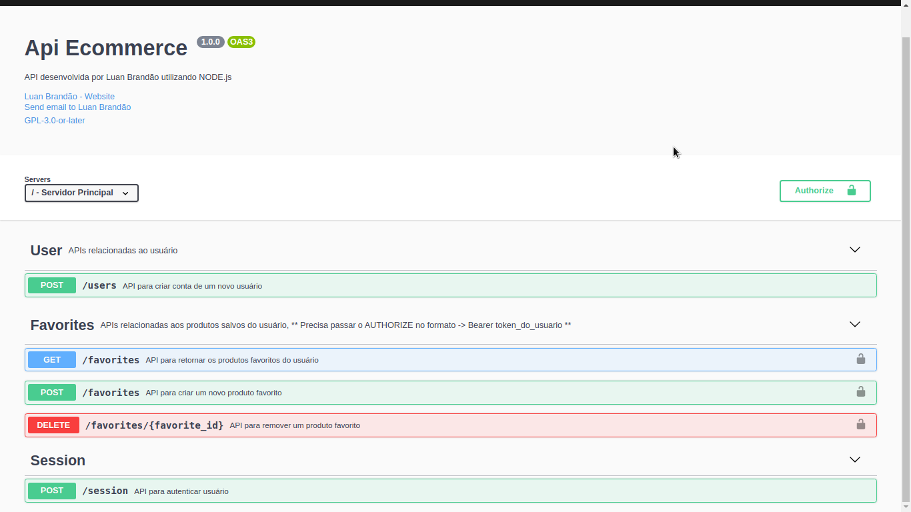

## :wrench: API desenvolvida utilizando a arquitetura DDD

## :wrench: Tecnologias
:red_circle: Node

## :wrench: Ferramentas

:large_orange_diamond: ESLint
:large_orange_diamond: Lint Staged
:large_orange_diamond: Ts Node Dev
:large_orange_diamond: Prettier
:large_orange_diamond: Express
:large_orange_diamond: Bcrypt
:large_orange_diamond: Faker
:large_orange_diamond: Tsyringe
:large_orange_diamond: Celebrate
:large_orange_diamond: Uuidv4
:large_orange_diamond: Jsonwebtoken
:large_orange_diamond: Commit Linter
:large_orange_diamond: Husky
:large_orange_diamond: Supertest
:large_orange_diamond: TypeORM
:large_orange_diamond: Jest
:large_orange_diamond: Swagger
:large_orange_diamond: Docker

## Banco Dedos
:paperclip: PostgreSQL

## Estrutura da api
```sh
.
├── @types
│   └── express.d.ts
├── config
│   └── auth.ts
│   └── config-swagger.ts
├── modules
│   └── favorites
│       └── dtos
│       └── infra
│           └── http
│               └── controllers
│               └── doc
│                   └── paths
│                   └── schemas
│               └── routes
│           └── typeorm
│               └── entities
│               └── repositories
│       └── repositories
│           └── fakes
│       └── services
│   └── users
│       └── dtos
│       └── infra
│           └── http
│               └── controllers
│               └── doc
│                   └── paths
│                   └── schemas
│               └── routes
│           └── typeorm
│               └── entities
│               └── repositories
│       └── providers
│           └── HashProvider
│               └── fakes
│               └── implementations
│               └── models
│       └── repositories
│           └── fakes
│       └── services

├── shared
│   └── container
│   └── docs
│   └── errors
│   └── infra
│       └── http
│           └── routes
│           └── server.ts
│       └── typeorm
│           └── migrations
│   └── protocols


favorites
```

## :ballot_box_with_check: Execucanto o projeto
!!! Para executar os comandos abaixo é priciso ter o docker instalado, caso tenho o postgres instalado pode pular esses passos.
</br>
:heavy_check_mark: Criando container do banco postgres no docker
 escolhi a porta 5433, você pode optar por outra
<br>

``` docker run --name postgres -e POSTGRES_PASSWORD=SUA_SENHA -p 5433:5432 -d postgres:11 ```

:heavy_check_mark: rodando o container do postgres
<br>

```  docker start postgres ```


:heavy_check_mark: Banco de dados
<p> Crie um banco de dados com o nome 'aftersale' e altere suas credenciais no arquivo 'ormconfig.json' </p>

:heavy_check_mark: Criando o Banco de dados
``` yarn typeorm migrations:run ```

## :ballot_box_with_check: Rodando nossa API
Antes de executar esse comando verifique se seu banco de dados está rodando  </br>
``` yarn dev:server ``` 

## :ballot_box_with_check: TESTES
``` yarn test ``` </br>
``` yarn test:watch ``` </br>
``` yarn test:verbose ``` </br>
``` yarn test:staged ``` </br>
``` yarn test:ci ``` </br>


## :ballot_box_with_check: Documentação 
 acesse: http://localhost:3333/api-docs/#/ 
<br>

<div align="center" , dis>

</div>